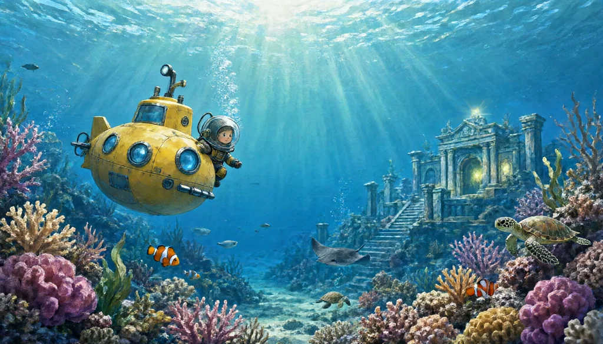

# 深海秘境 Deep Sea Atlantis

可愛卡通風的 3D 海底探險遊戲。駕駛小潛艇潛入大海，拍照收集 39 種海洋生物，找回亞特蘭提斯的五塊石板，喚醒沉睡的神殿。

**▶ 直接玩：https://tlan1012.github.io/deep-sea-atlantis/**（電腦、手機、平板都可以）



## 玩法

- **拍照收集**：把生物放進畫面中央的框框再拍照，就會收進圖鑑，每種都附一段冷知識。
- **五個海域**：珊瑚礁 → 巨藻森林 → 暮光層 → 深淵海溝 → 亞特蘭提斯遺跡。越往下越暗，記得開探照燈。
- **找石板**：畫面上方的箭頭和右上角的小地圖會指出石板位置。最後一塊在神殿裡，門太窄潛艇進不去，要出艙換潛水員游進去（注意氧氣）。
- **五塊到齊**：亞特蘭提斯甦醒，播放里程碑動畫，海龍守護神現身。

| 操作 | 電腦 | 手機 |
|---|---|---|
| 轉方向 | **按住滑鼠拖曳**（最順手：往哪裡看就往哪裡游） | 右手拖曳 |
| 移動 | W A S D | 左手拖曳（虛擬搖桿） |
| 上升 / 下潛 | 空白鍵 / Shift | ⬆ ⬇ 按鈕 |
| 拍照 | R | 📷 |
| 探照燈 | F | 💡 |
| 出艙 / 登艇 | Q | 🚪 |
| 圖鑑 / 地圖 | B / M（或點小地圖） | 📖 / 🗺️ |

進度存在瀏覽器裡，下次打開會接著玩。

## 怎麼做的

整個遊戲是 Claude Code（Claude Opus 5.5）寫的程式，美術全部在本機生成：

- **圖**：本機 RTX 3060 筆電上的 Qwen-Image 2.1（ComfyUI，turbo 4 步，一張約 15～25 秒）。共生成 62 張：39 種生物、11 種珊瑚與植物、5 種地面材質、道具和標題畫面；有 2 張重畫過（「小飛象章魚」第一次被畫成一頭大象）。生物畫在白底上，由 `tools/gen.py` 自動去背成透明貼圖；材質自動處理成可無縫鋪排。
- **里程碑影片**：Qwen 用遊戲裡的海龍圖當角色參考畫出起始畫面，再透過 tailnet 送到另一台 RTX 4070 的影片生成服務做成 5 秒動畫（約 3 分鐘）。
- **程式**：Three.js。生物是「紙片」風格：貼圖平面沿著游泳方向擺尾（水母、章魚改成面向鏡頭的看板）；海床、光柱、焦散光紋、霧、探照燈都是自訂 shader。音效全部用 WebAudio 即時合成，沒有音檔。

```
index.html          介面與樣式
js/main.js          主程式：載入、輸入、HUD、圖鑑、地圖、拍照、石板
js/world.js         海床地形、岩石、植物、亞特蘭提斯遺跡、碰撞
js/creatures.js     39 種生物的資料（含圖鑑文字）與游泳 AI
js/player.js        潛艇與潛水員模型、操作與鏡頭
js/shaders.js       水下光照、焦散、霧、探照燈
js/sound.js         合成音效
tools/assets.py     每張圖的提示詞
tools/gen.py        呼叫生圖服務、去背、做無縫材質
```

## 開發紀錄

| 時間（台灣） | 事件 |
|---|---|
| 9/26 22:59 | 藍醫師提出企劃：用本機生圖工具做 3D 海底探索遊戲 |
| 9/26 23:01 | 指定需求：可愛卡通風、電腦與手機、潛水艇、潛水員、深海魚、亞特蘭提斯遺跡 |
| 9/26 23:03 | 第一批 4 張測試素材生成 |
| 9/26 23:38 | **第一版上線**：59 張素材、5 個海域、39 種生物、拍照圖鑑、石板任務 |
| 9/27 00:07 | 試玩回饋：要小地圖、顯示成績、說明滑鼠操作；提議用 4070 做里程碑影片 |
| 9/27 00:11 | 小地圖與成績上線 |
| 9/27 00:16 | 甦醒里程碑影片上線 |
| 9/27 11:37 | 上架 GitHub 讓朋友玩 |

- **從提出需求到第一版可以玩：37 分鐘**（23:01 → 23:38）
- **第二輪改版（小地圖、成績、影片）：約 20 分鐘**
- **Claude 實際工作時間合計：約 1 小時**
- **藍醫師下的指示：4 次**
  1. 提出企劃
  2. 指定風格、平台和內容
  3. 試玩回饋（小地圖、成績、滑鼠說明、里程碑影片）
  4. 上架 GitHub

  除此之外，其餘的設計、程式、美術提示詞、測試（無頭瀏覽器截圖檢查電腦與手機畫面）都由 Claude 自行完成。
